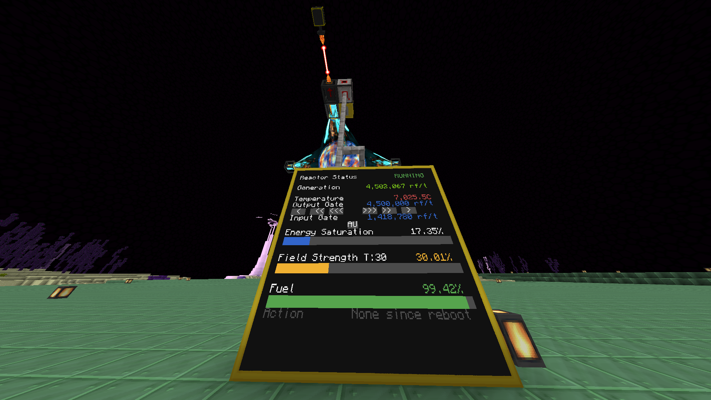
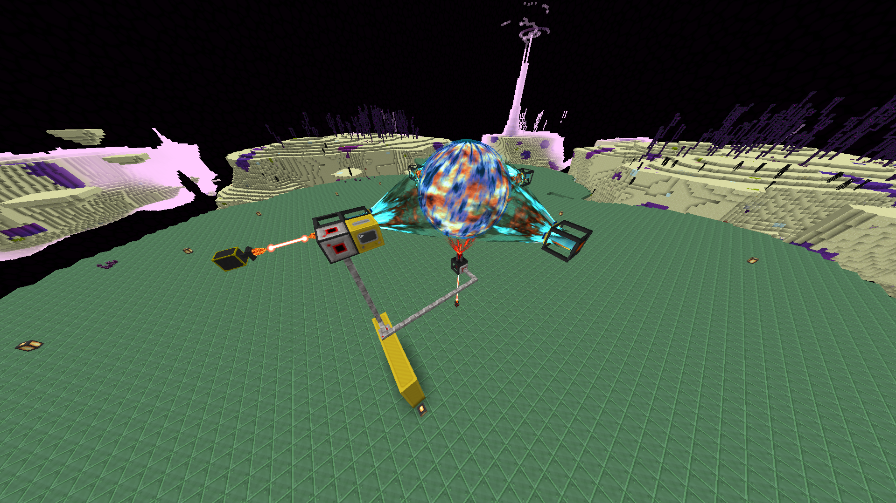

# drmon
monitor and failsafe automation for your draconic reactor




### what is this
this is a computercraft LUA script that monitors everything about a draconic reactor, with a couple features to help keep it from exploding
NB: This is for Minecraft 1.20.1, specifically tested for ATM9. Any changes in versions before or after the 0.3.2 ATM9 launch might need changes in the code.


### tutorial -- OUTDATED
you can find a very well made youtube tutorial on how to set this up [here](https://www.youtube.com/watch?v=8rBhQP1xqEU) , thank you [The MindCrafters](https://www.youtube.com/channel/UCf2wEy4_BbYpAQcgvN26OaQ)

### features
* uses a 3x3 advanced computer touchscreen monitor to interact with your reactor
* automated regulation of the input gate for the targeted field strength of 50%
  * adjustable
* immediate shutdown and charge upon your field strength going below a customisable amount
  * reactor will activate upon a successful charge
* immediate shutdown when your temperature goes above 8000C
  * adjustable
  * reactor will activate upon temperature cooling down to 3000C
    * adjustable

* easily tweak your output flux gate via touchscreen buttons
  * +/-100k, 10k, and 1k increments

### requirements
* one fully setup draconic reactor with fuel
* 1 advanced computer
* 9 advanced monitors
* 3-4 wired modems, wireless will not work
* a bunch of network cable

### installation
* Set up your reactor.
* Place your advanced computer so that it's back is against a stabilser.
* Place a modem on your computer.
* Place a modem on the flux gate where the power will be going OUT from.
* Place a modem on the flux gate which is feeding your reactor energy injector.
* Place a modem on your monitor.
* (You can use a block type modem if you want and connect your OUTput flux gate and your computer that way.)
* Run network cables from your modems to the modem connected to your computer and make sure you turn them on.
* When you turn on the modem, the game will put a message into the chat saying the name of the device you connected. Make sure to note these down as you will need them.
* Install the script using these commands in your advanced computer: 

```
> pastebin get 3fyy7Uzr install
> install
```
* Modify the `startup.lua` file that was created upon running the installation script to fit your setup: set the ```outPutFluxGate``` (line 3) to the name that the game put in the chat when you started the modem on the flux gate that power will be going OUT from. Do the same on line 4 for `inputFluxGate`.
```
> startup
```
* you should see stats in your term, and on your monitor

### upgrading to the latest version
* right click your computer
* hold ctrl+t until you get a `>`

```
> install
> startup
```
# Note
If you want to fiddle around with screen sizes, you can add a text scaling line under line 32 that searches for your monitor. Scaling 1.5 looks fine on a 5x5 monitor for example.